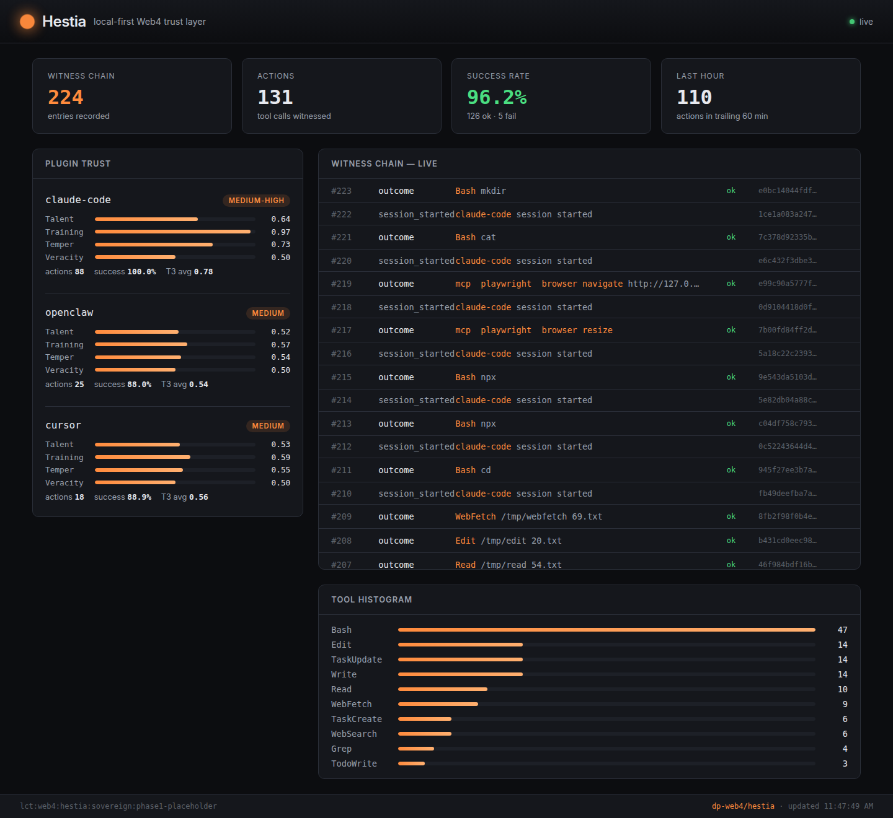

# Hestia Dashboard

Two views of the same data, served by the same daemon:

- **Web** — open a browser to `http://127.0.0.1:7711/`
- **TUI** — `hestia dashboard` in any terminal

Both poll the same JSON endpoint (`GET /api/dashboard`) every 1–2s and
re-render with whatever the daemon currently has in its witness chain
and trust store. There's no separate UI database to fall out of sync.

## Web view



The page is a single self-contained HTML file embedded into the binary
via `include_str!`. No build step, no JS framework, no external assets
— vanilla DOM with a fetch loop. Drop the binary on a machine and the
dashboard ships with it.

What you see at a glance:

- **Top stats** — chain length, total actions recorded, success rate
  across all plugins, actions in the trailing 60 minutes.
- **Plugin trust** — one card per known plugin. T3 tensor dimensions
  (Talent / Training / Temperament) and V3 Veracity rendered as bars
  in the hearth-fire accent. Trust level pill on the right. Cumulative
  action count + success rate.
- **Witness chain — live** — newest entries first, fading in as they
  arrive. Tool name highlighted in the accent. Success/fail badge.
  Hash prefix on the right so you can spot-check linkage.
- **Tool histogram** — usage by tool class, sorted descending.
- **Footer** — sovereign LCT, daemon URL, last-update timestamp.

The live indicator (top right) pulses while the daemon is reachable
and flips to "offline" if the next poll fails.

## TUI view

```
hestia dashboard
hestia dashboard --endpoint http://127.0.0.1:7711
```

Same layout, terminal-rendered with `ratatui`. Polls every 1 s. `q`,
`Esc`, or `Ctrl+C` to quit. Useful when you're sshed into a machine
with no browser, or just want a low-distraction live view next to
your editor.

## API

`GET /api/dashboard` returns a `DashboardSnapshot` JSON:

```json
{
  "society": {
    "sovereign_lct": "lct:web4:hestia:sovereign:phase1-placeholder",
    "chain_length": 224,
    "active_sessions": 0,
    "vault_entries": 0,
    "known_plugins": 3
  },
  "stats": {
    "total_actions": 131,
    "successful_actions": 126,
    "failed_actions": 5,
    "success_rate": 0.9618,
    "by_tool": [["Bash", 39], ["Read", 28], ["Edit", 14], ...],
    "actions_last_hour": 110
  },
  "trust": [
    {
      "plugin_id": "claude-code",
      "level": "medium-high",
      "t3_talent": 0.61,
      "t3_training": 0.78,
      "t3_temperament": 0.65,
      "t3_average": 0.68,
      "v3_veracity": 0.51,
      "action_count": 88,
      "success_count": 88,
      "success_rate": 1.0,
      "days_since_last": 0.001
    }
  ],
  "recent": [ /* recent N chain entries, newest first */ ],
  "generated_at": "..."
}
```

Anything else you want to build — a Slack notifier, a CI gate that
reads trust state, a smartphone view — should target this endpoint.
Both bundled views are just consumers of it.

## Why both

Investors and non-technical users open a URL and see motion.
Developers and ops people live in terminals; spawning a window for a
dashboard breaks flow. Same data, two surfaces, neither one is the
canonical one — they're peers of the JSON API.
